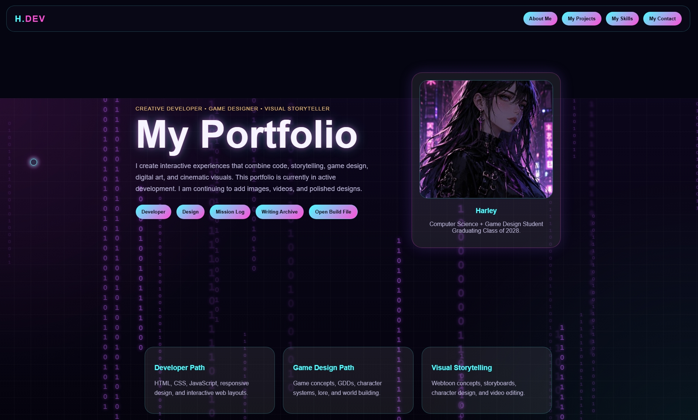
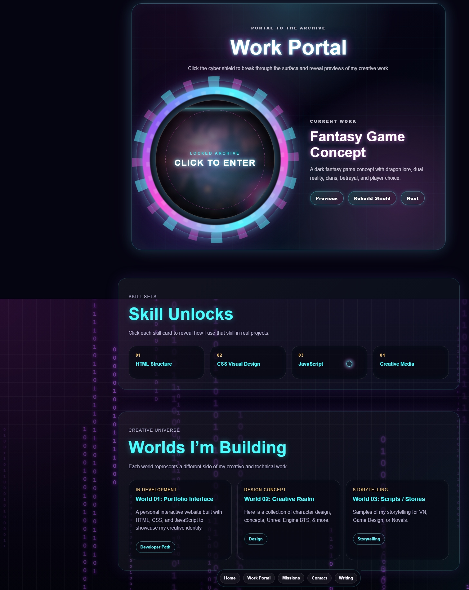
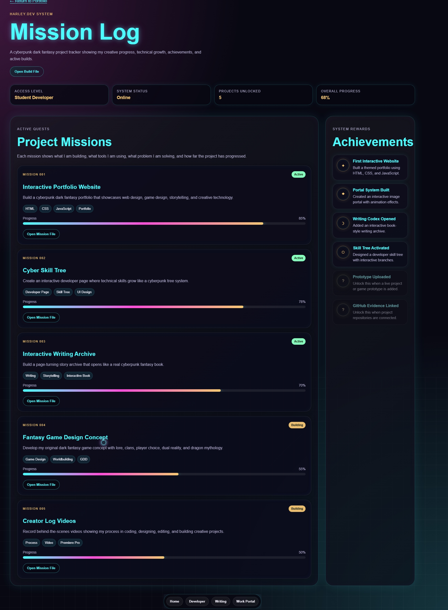
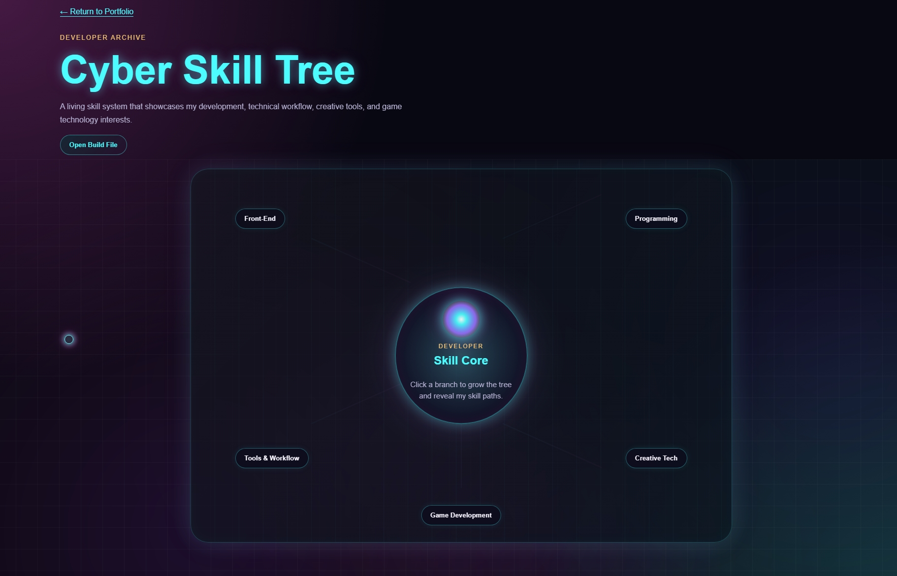
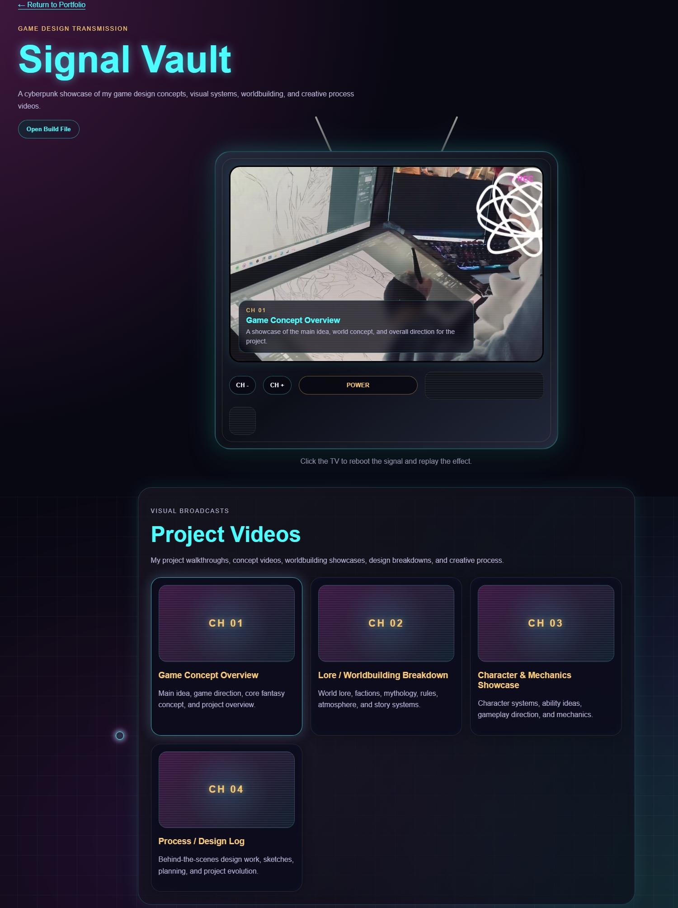
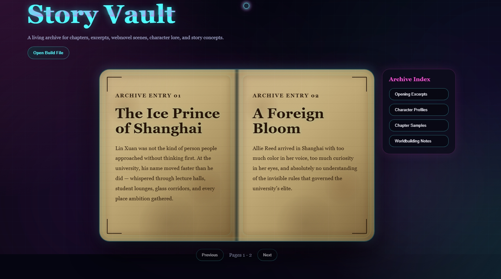
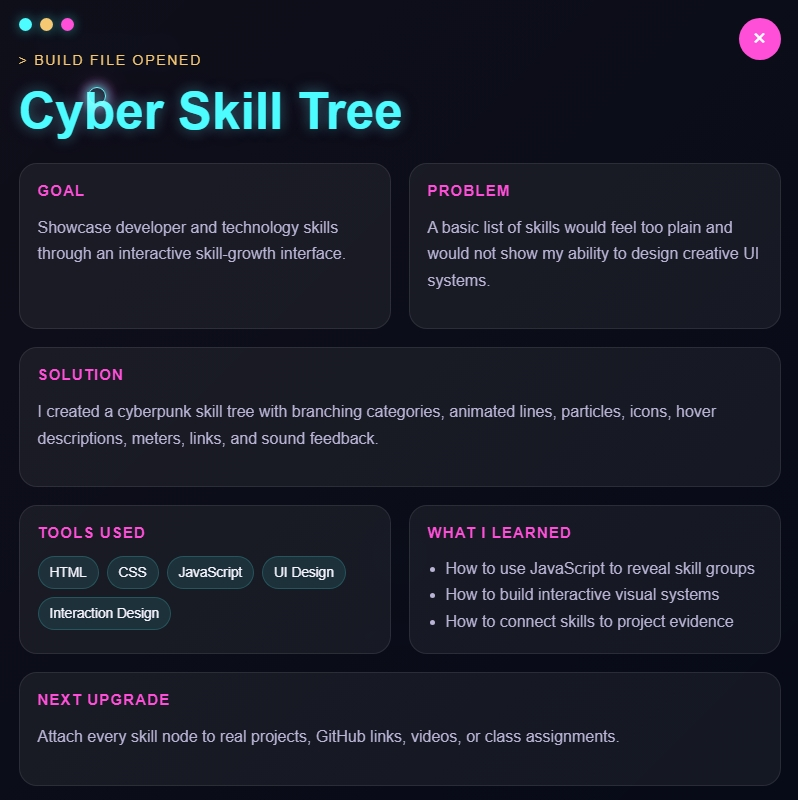
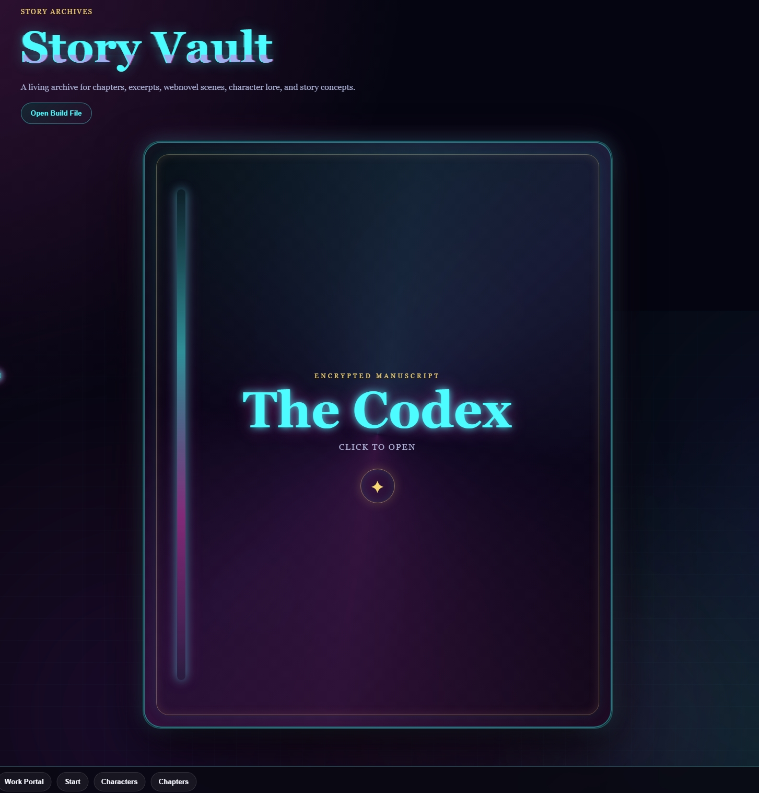

# Harley-Portfolio
This is my interactive creative portfolio built with HTML, CSS, and JavaScript.
It showcases my web design, game design, writing, video editing, and visual storytelling projects.

## Features

- Cyberpunk / Fantasy visual theme
- Animated loading screen
- Custom Cursor
- Interactive Portal
- Mission log project page
- Design video vault
- Writing Archive
- Developer Skill Tree
- Case study terminal
- Animated background and purple fog effects

## Portfolio Preview

| Main Portfolio | Work Portal |
|---|---|
|  |  |

| Mission Log | Developer Page |
|---|---|
|  |  |

| Signal Vault | Story Vault |
|---|---|
|  |  |

| Skill Tree Build File | Story Codex |
|---|---|
|  |  |

## Screenshot Overview

- **Main Portfolio Page:** Introduces my creative developer identity and portfolio navigation.
- **Work Portal:** Interactive cyberpunk archive entrance for featured creative work.
- **Mission Log:** Tracks active projects, progress, achievements, and creative builds.
- **Developer Page:** Displays my skills through an interactive cyber skill tree system.
- **Signal Vault:** Showcases game design concepts, project videos, and design breakdowns.
- **Story Vault:** Presents writing samples, character concepts, and story archive content.
  
## Built with

- HTML
- CSS
- JavaScript
- Visual Studio Code
- Notepad++

## Purpose

I created this portfolio to showcase my creative and technical skills for college opportunities, internships, and future web development, game design, and creative technology positions.

## Live Site

https://harleyjeanhuggins.github.io/Harley-Portfolio/

## Current Status

This project is still in progress. I am continuing to add to it for finalization on the inner content.
